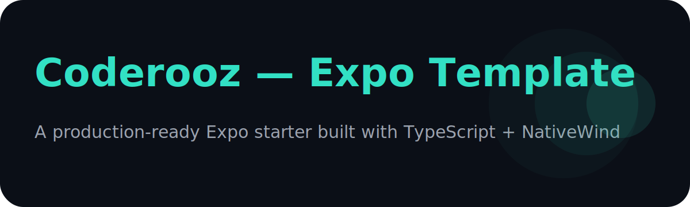

# Coderooz — Expo Template

<p align="center">
  
</p>

[](LICENSE)
[](https://expo.dev)
[](https://www.typescriptlang.org/)
[](https://www.nativewind.dev/)
[]()
[]()
[]()
[]()
[]()

A production-ready Expo starter template using TypeScript, NativeWind (Tailwind CSS), Drawer navigation, SQLite, Notifications and OTA updates — crafted for teams and solo developers who want to build reliable real apps fast.

> This repository serves both as a **template for new projects** and the **foundation of a future interactive app-setup CLI**.


---

## ✨ Features

| Category | Tech |
|--------|------|
| Framework | Expo (Managed Workflow) |
| Language | TypeScript (strict) |
| UI | NativeWind (Tailwind CSS) |
| Navigation | Expo Router + Drawer |
| Storage | Expo SQLite utilities |
| Notifications | Local + push token helper |
| Updates | Expo OTA updates |
| Developer Experience | Metro + Tailwind + ESLint + Prettier preconfigured |

---

## 🚀 Create a new app using this template

### Recommended (npm registry)
```bash
npx create-expo-app my-app --template expo-template-coderooz
````

### Direct from GitHub (latest)

```bash
npx create-expo-app my-app --template https://github.com/coderooz/expo-template-coderooz
```

### Specific release/tag

```bash
npx create-expo-app my-app \
  --template https://github.com/coderooz/expo-template-coderooz#v1.0.3
```

---

## 📁 Project structure

```
.
├── App.tsx
├── app.json
├── src
│   ├── components
│   ├── context
│   ├── hooks
│   ├── navigation
│   ├── screens
│   ├── services (api / db / notifications)
│   └── lib
├── assets
├── tsconfig.json
├── babel.config.js
├── metro.config.js
└── tailwind.config.js
```

---


## 🧪 Recommended development workflow (for contributors)

```bash
git clone https://github.com/coderooz/expo-template-coderooz
cd expo-template-coderooz
npm install
npm run start
```

Before pushing:

```bash
npm run lint
```

---

## 🗺️ Roadmap

| Status | Item                                                 |
| ------ | ---------------------------------------------------- |
| ✔️     | Base TypeScript + NativeWind                         |
| 🔜     | Drawer navigation + examples                         |
| 🔜     | SQLite utilities                                     |
| 🔜     | Notifications helper                                 |
| 🔜     | Interactive setup script                             |
| 🔜     | Publish to npm                                       |
| 🔜     | Optional UI presets (shadcn / RN Paper / minimalist) |
| 🔜     | CI: Expo Doctor + Type checks                        |

---

## 📚 References & documentation

| Resource           | Link                                                                                                               |
| ------------------ | ------------------------------------------------------------------------------------------------------------------ |
| Expo documentation | [https://docs.expo.dev](https://docs.expo.dev)                                                                     |
| Expo Router        | [https://docs.expo.dev/router/introduction](https://docs.expo.dev/router/introduction)                                                     |
| NativeWind         | [https://www.nativewind.dev](https://www.nativewind.dev)                                                           |
| React Navigation   | [https://reactnavigation.org](https://reactnavigation.org)                                                         |
| SQLite (Expo)      | [https://docs.expo.dev/versions/latest/sdk/sqlite](https://docs.expo.dev/versions/latest/sdk/sqlite)               |
| Expo Notifications | [https://docs.expo.dev/versions/latest/sdk/notifications](https://docs.expo.dev/versions/latest/sdk/notifications) |
| Expo OTA Updates   | [https://docs.expo.dev/versions/latest/sdk/updates](https://docs.expo.dev/versions/latest/sdk/updates)             |

---

## 🙋 Support

If this template helped you, consider:

- ⭐ **Starring the repository**
- 🗣️ **Sharing it with other Expo developers**
- 🤝 **Contributing features and fixes**


Discussions, feature requests & issues:
[https://github.com/coderooz/expo-template-coderooz/issues](https://github.com/coderooz/expo-template-coderooz/issues)

---

## 🤝 Contributing

1. Fork the repo
2. Create a feature branch:
   `git checkout -b feat/your-feature`
3. Commit with useful messages
4. Open a PR describing the change and rationale

---

## 👤 Author

**Coderooz**
- 🔗 GitHub — [https://github.com/coderooz](https://github.com/coderooz)
- 📧 Email — [coderooz.dev@gmail.com](mailto:coderooz.dev@gmail.com)

---

## 📜 License

This project is licensed under the **MIT License**.

MIT © Coderooz
